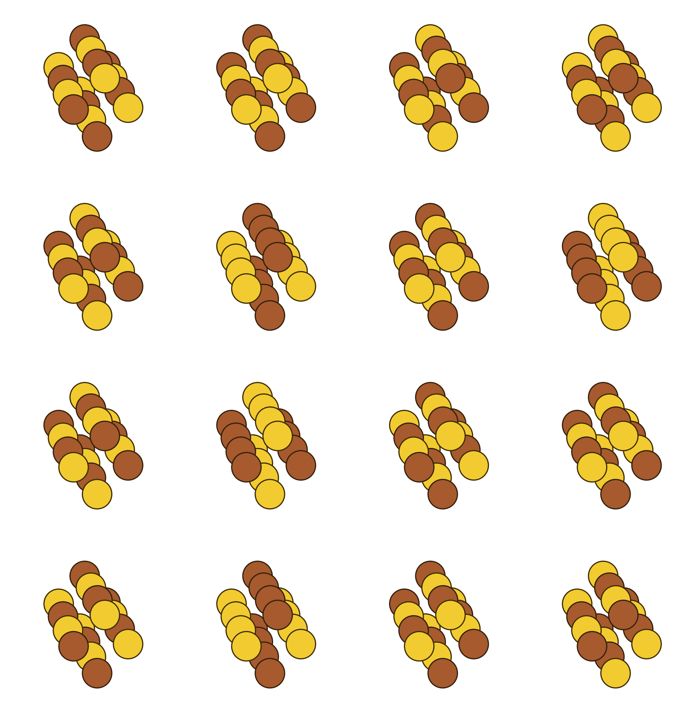
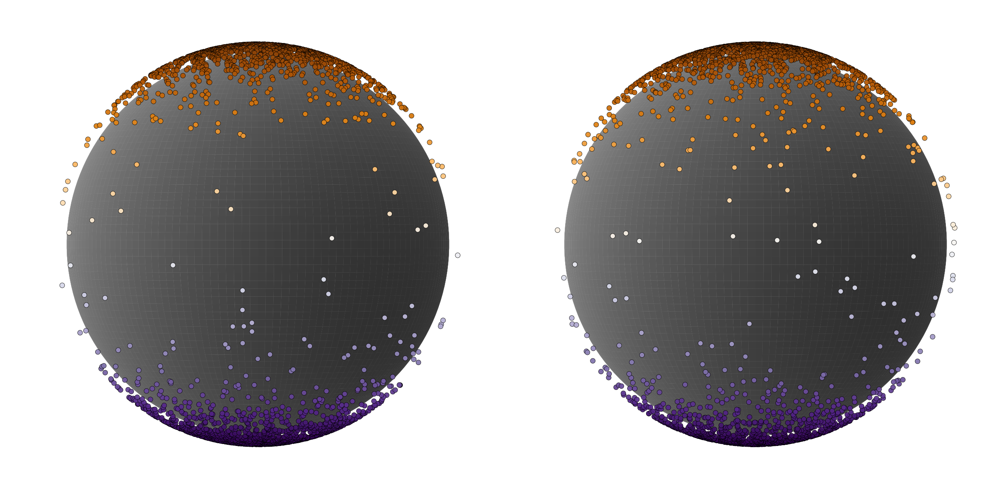
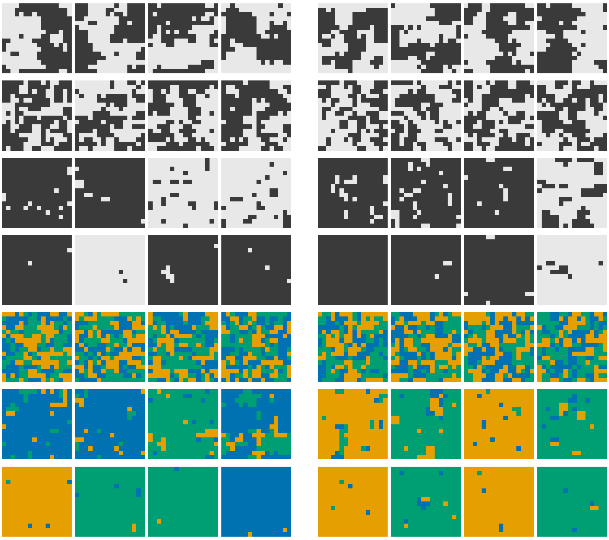

# TMLR figure drafts

Evaluation only. Per-panel checkpoint, seed, weights, RNG seed and selection
rule are in `manifest.json`.

## F3 — Cu–Au 2×2×4, four most probable configurations

Rows: exact / learned at 1200 K, exact / learned at 680 K. Each row ranked by
its own law over all C(16,8) = 12870 states. Au gold, Cu copper.

## F4 — sphere, E = 6(1 − x₃²)

Reflection-trained (left) vs no reflection (right). Points coloured by x₃.

## F7 — 16×16 lattice snapshots

Learned (left 4) vs Swendsen–Wang reference (right 4). Rows: canonical Ising
β = 0.4407; free Ising β = 0.28 / 0.4407 / 0.6; free 3-state Potts
β = 0.5 / 1.005 / 1.2.
