# HL-Mando GEO04 — all 20 BC solves vs ground truth

MESHnSOLVERS augmented-Lagrange contact + compliant rubber-spring grounding. Per-sample only the rubber spring k is calibrated (GT-informed); contact recipe (eps=5e4, mu=0.07, 2 load steps, AMG-PCG) is identical for every sample.

## Metrics (best round per BC)

| BC | k | rel-L2 | rel-L2 (1 scale) | best-scale | dir-cos | node-err mean (mm) | node-err p95 (mm) | solve s | target |
|----|---|--------|------------------|-----------|---------|-------------------|------------------|---------|--------|
| BC01 | 5 | 0.283 | 0.274 | 0.932 | 0.963 | 0.069 | 0.137 | 2447 | ✅ |
| BC02 | 12.99 | 0.381 | 0.380 | 0.991 | 0.941 | 0.130 | 0.276 | 2947 | ✗ |
| BC03 | 5 | 0.314 | 0.310 | 0.953 | 0.957 | 0.080 | 0.162 | 2676 | ✗ |
| BC04 | 14.9 | 0.385 | 0.379 | 0.932 | 0.915 | 0.126 | 0.330 | 2677 | ✗ |
| BC05 | 5 | 0.244 | 0.222 | 0.906 | 0.973 | 0.057 | 0.111 | 2524 | ✅ |
| BC06 | 11.24 | 0.285 | 0.197 | 0.827 | 0.982 | 0.071 | 0.152 | 2643 | ✅ |
| BC07 | 10.19 | 0.354 | 0.354 | 1.018 | 0.941 | 0.100 | 0.189 | 2638 | ✗ |
| BC08 | 13.2 | 0.357 | 0.357 | 0.993 | 0.950 | 0.131 | 0.256 | 2690 | ✗ |
| BC09 | 5.58 | 0.376 | 0.369 | 0.928 | 0.942 | 0.133 | 0.260 | 2628 | ✗ |
| BC10 | 15.34 | 0.365 | 0.365 | 0.999 | 0.947 | 0.134 | 0.338 | 2697 | ✗ |
| BC11 | 6.35 | 0.299 | 0.241 | 0.845 | 0.970 | 0.068 | 0.126 | 2410 | ✅ |
| BC12 | 15.6 | 0.449 | 0.448 | 0.970 | 0.928 | 0.127 | 0.269 | 2195 | ✗ |
| BC13 | 33.74 | 0.168 | 0.166 | 1.027 | 0.956 | 0.092 | 0.217 | 2198 | ✅ |
| BC14 | 8.72 | 0.459 | 0.287 | 0.728 | 0.936 | 0.433 | 0.976 | 2442 | ~ |
| BC15 | 7.43 | 0.360 | 0.360 | 0.994 | 0.939 | 0.125 | 0.247 | 3464 | ✗ |
| BC16 | 12.23 | 0.384 | 0.383 | 1.009 | 0.943 | 0.150 | 0.300 | 2552 | ✗ |
| BC17 | 5 | 0.339 | 0.329 | 0.920 | 0.953 | 0.156 | 0.300 | 2406 | ✗ |
| BC18 | 14.66 | 0.299 | 0.299 | 0.999 | 0.970 | 0.125 | 0.304 | 2570 | ✅ |
| BC19 | 16.17 | 0.281 | 0.277 | 1.048 | 0.964 | 0.068 | 0.128 | 2797 | ✅ |
| BC20 | 17.21 | 0.320 | 0.317 | 0.955 | 0.960 | 0.070 | 0.158 | 2742 | ✗ |

**Summary:** 20/20 solved, 7/20 hit rel-L2 ≤ 0.30. mean rel-L2 = 0.335, mean dir-cos = 0.951.

Legend: ✅ rel-L2 ≤ 0.30 · ~ within target after one global scale (magnitude-only residual) · ✗ miss.

## Per-sample point clouds (GT vs solver)

### BC01
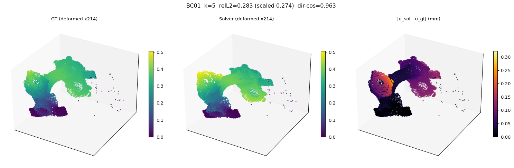

### BC02
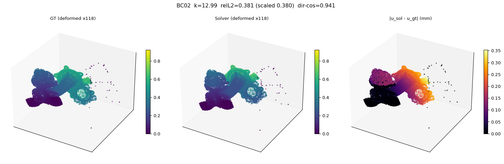

### BC03
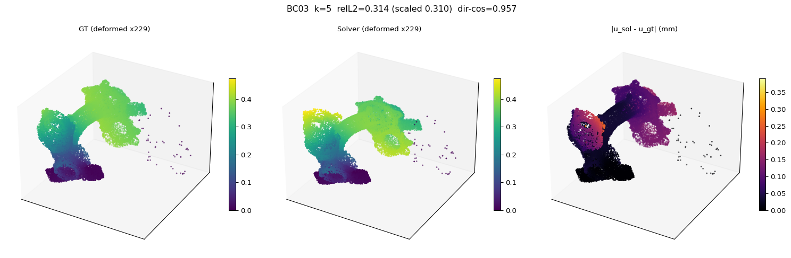

### BC04
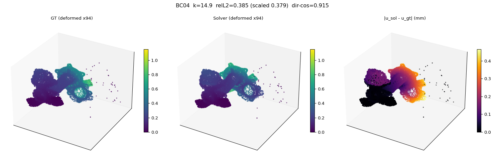

### BC05
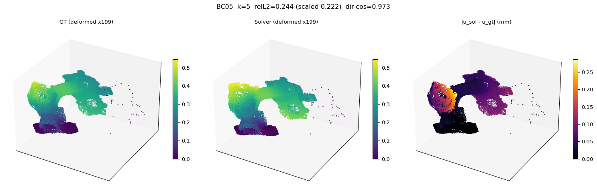

### BC06
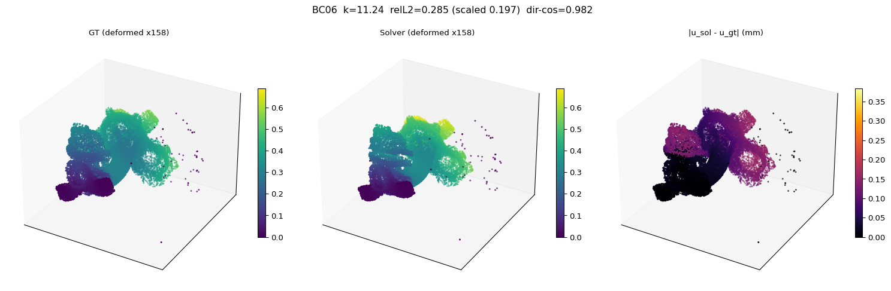

### BC07
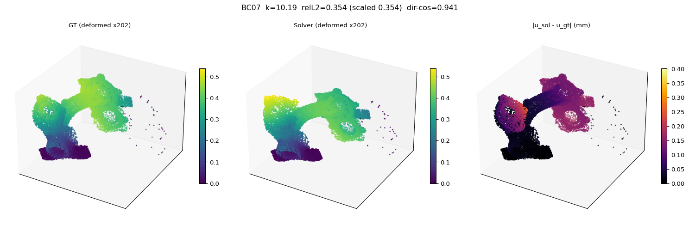

### BC08
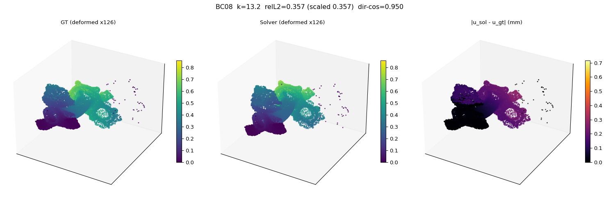

### BC09
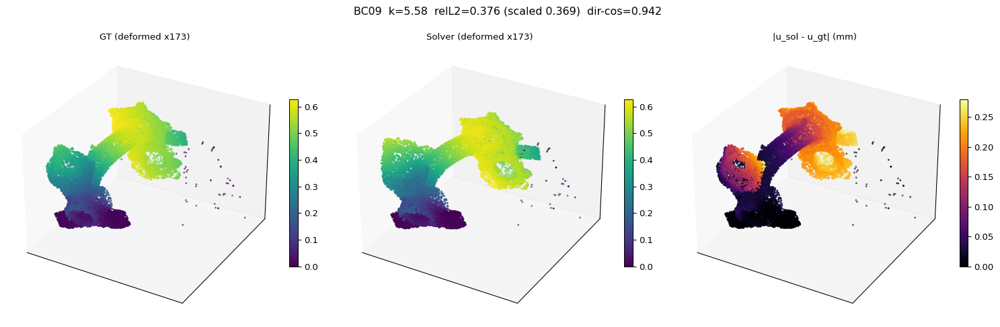

### BC10
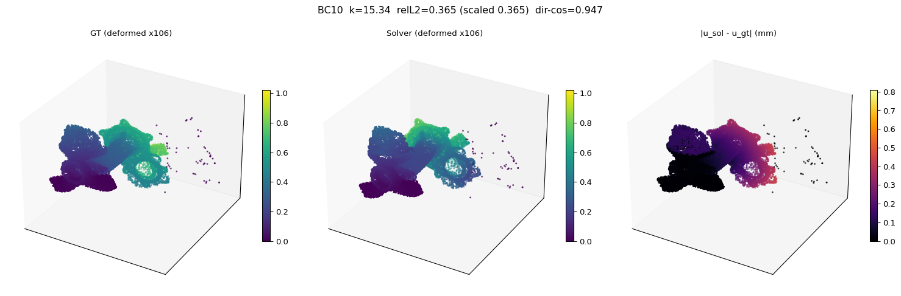

### BC11
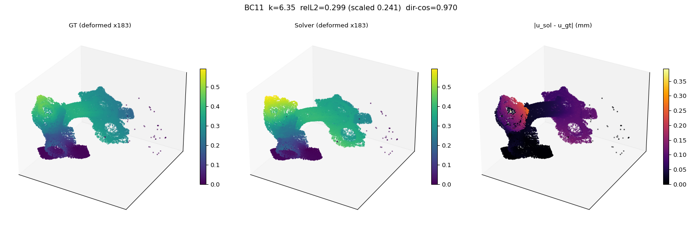

### BC12
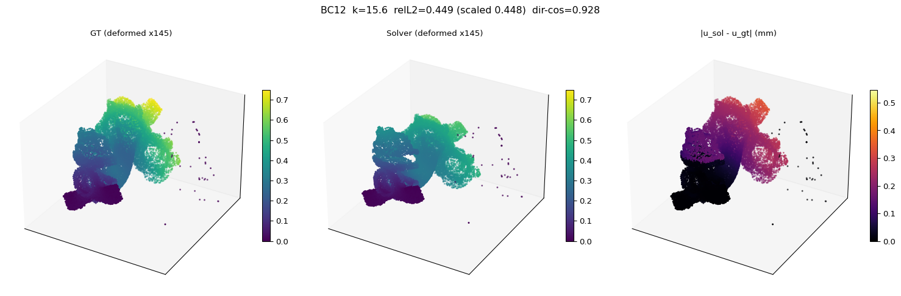

### BC13
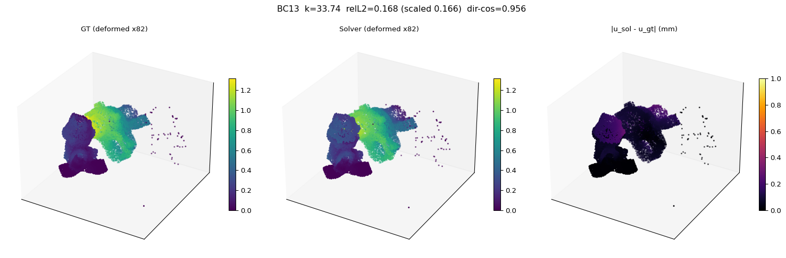

### BC14
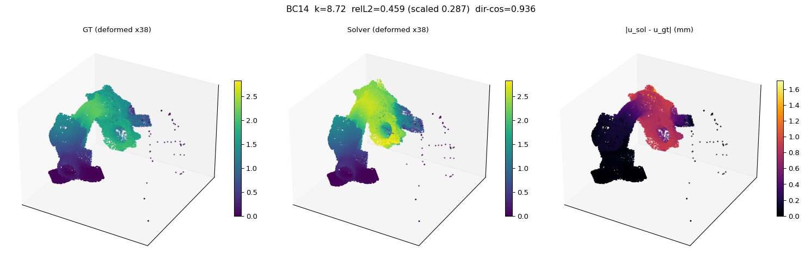

### BC15
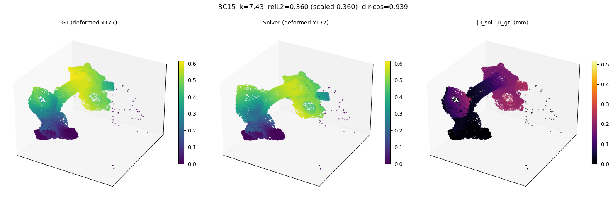

### BC16
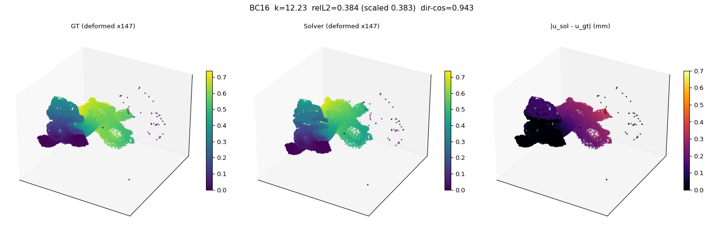

### BC17
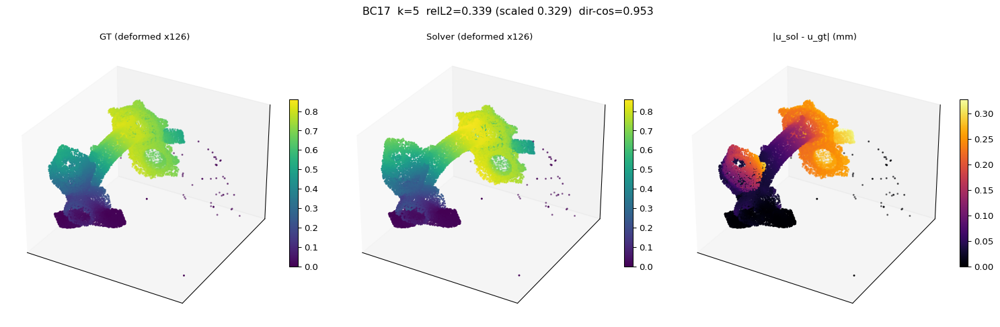

### BC18
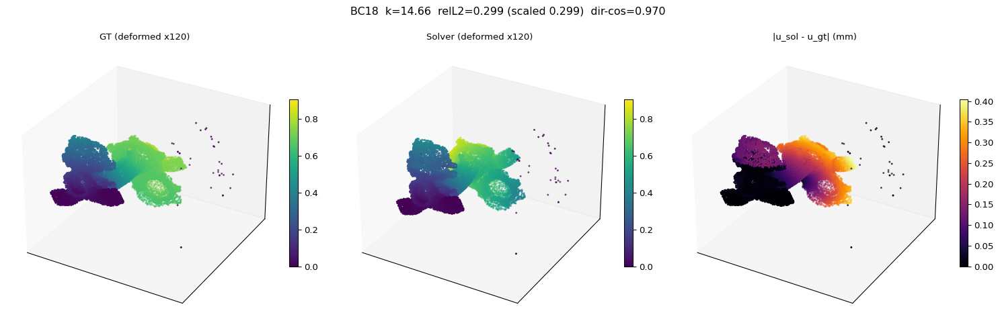

### BC19
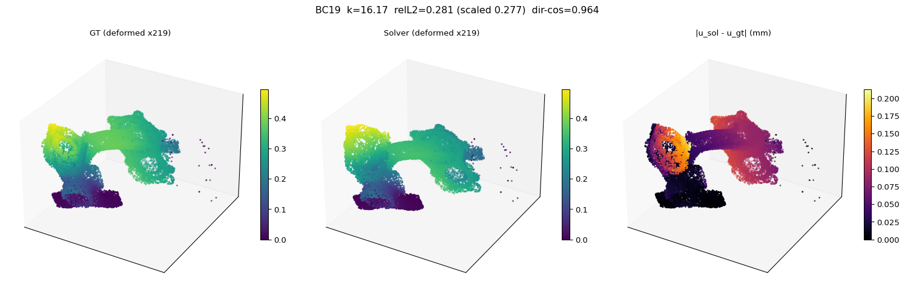

### BC20
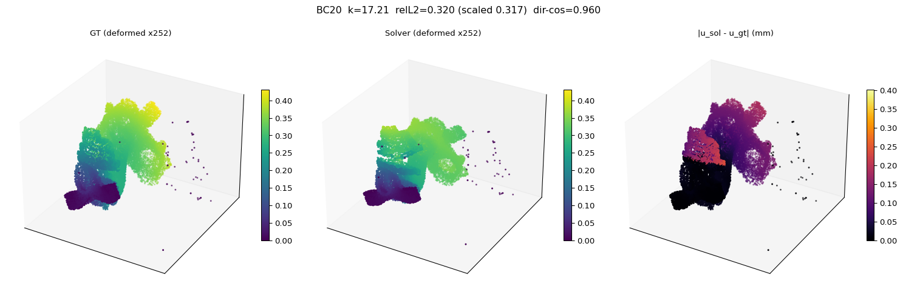
