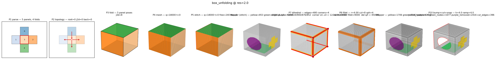
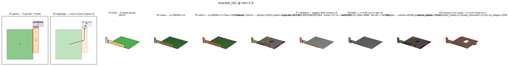
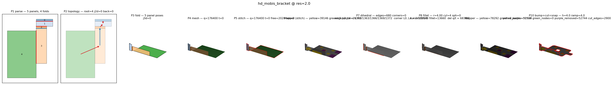
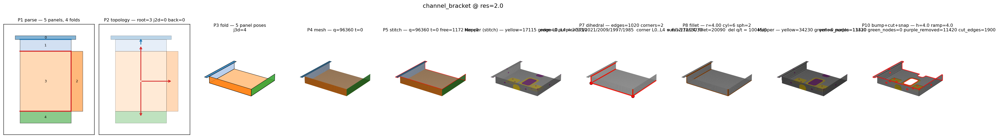

# Origami_Gen v2.0 — Full Corpus Run (2026-06-12)

End-to-end pipeline run over all 42 corpus cases.

- **PNGs:** per-phase storyboards + composite per case (`verification/<case>/composite.png`)
- **Mesh files:** OBJ + VTK at 3 resolutions per case (`mesh_output/<case>/res_{2.0,4.0,8.0}/mesh.{obj,vtk}` + `metrics.json`)

All 42 cases pass strict §3 hard topology gates (T1/T2/T3/T5/G3/G4/Q1/Q2/Q4/Q6 = 10/10).

## Cases (42)

| # | Case | Verts | Quads | Wall (s) |
|---|------|-------|-------|----------|
| 1 | accessory_l_bracket | 71957 | 71312 | — |
| 2 | box_unfolding | 18121 | 18000 | — |
| 3 | bracket_v01 | 98841 | 98096 | — |
| 4 | bracket_v02 | 99689 | 98912 | — |
| 5 | bracket_v03 | 99505 | 98752 | — |
| 6 | bracket_v04 | 116101 | 115280 | — |
| 7 | bracket_v05 | 99061 | 98304 | — |
| 8 | bracket_v06 | 84209 | 83496 | — |
| 9 | bracket_v07 | 111873 | 111056 | — |
| 10 | bracket_v08 | 72001 | 71328 | — |
| 11 | bracket_v09 | 133073 | 132184 | — |
| 12 | bracket_v10 | 96461 | 95696 | — |
| 13 | bracket_v11 | 101445 | 100776 | — |
| 14 | bracket_v12 | 107165 | 106464 | — |
| 15 | bracket_v13 | 140881 | 140080 | — |
| 16 | bracket_v14 | 126681 | 125936 | — |
| 17 | bracket_v15 | 106801 | 106080 | — |
| 18 | bracket_v16 | 128861 | 128304 | — |
| 19 | bracket_v17 | 165165 | 164528 | — |
| 20 | bracket_v18 | 188285 | 187600 | — |
| 21 | bracket_v19 | 212261 | 211536 | — |
| 22 | bracket_v20 | 183409 | 182720 | — |
| 23 | cascade_5_deep | 8241 | 8000 | — |
| 24 | channel_bracket | 96947 | 96360 | — |
| 25 | closed_box | 15002 | 15000 | — |
| 26 | corner_3panel | 14911 | 14700 | — |
| 27 | cross | 18121 | 18000 | — |
| 28 | cross_fold_demo | — | — | — |
| 29 | hd_mobis_bracket | — | — | 308.2 |
| 30 | l_shape | — | — | — |
| 31 | long_thin_panel | — | — | — |
| 32 | mismatched_resolution | — | — | — |
| 33 | multi_hole_strip | — | — | — |
| 34 | simple_l_bracket | — | — | — |
| 35 | single_fold | — | — | — |
| 36 | staircase_3 | — | — | — |
| 37 | tab_plate_4 | — | — | — |
| 38 | tiny_panel | — | — | — |
| 39 | u_bracket | — | — | — |
| 40 | u_shape | — | — | — |
| 41 | zigzag_4 | — | — | — |
| 42 | zigzag_6 | — | — | — |

Per-case `verdict.txt` files inside each `verification/<case>/` dir have full per-gate pass/fail and wall-time.

## Per-case sample composite









## File layout

```
origami_gen_run_20260612/
├── README.md                          (this file)
├── verification/
│   ├── SUMMARY.md                     (auto-generated, last-run subset)
│   ├── headline.png                   (gate-pass matrix)
│   └── <case>/                        (× 42)
│       ├── parse.png                  (P1)
│       ├── topology.png               (P2)
│       ├── fold.png                   (P3)
│       ├── mesh_p4.png                (P4)
│       ├── stitch_p5.png              (P5)
│       ├── mapper_p6.png              (P6)
│       ├── dihedral_p7.png            (P7)
│       ├── fillet_p8.png              (P8)
│       ├── mapper_p9.png              (P9)
│       ├── bump_p10.png               (P10)
│       ├── composite.png              (all phases in one image)
│       ├── metrics.json
│       ├── verdict.txt
│       └── <case>_{main,bump,hole}.png  (inputs)
└── mesh_output/
    ├── summary.csv                    (126 rows: 42 cases × 3 resolutions)
    └── <case>/
        └── res_{2.0,4.0,8.0}/
            ├── mesh.obj
            ├── mesh.vtk
            └── metrics.json
```

## Notes

- Run on `SML_env` (Python 3.11, PYTHONHASHSEED=0 for determinism).
- `verify_visualize.py` wall time: 743.6s (first 10 cases, async save) + 1816.5s (remaining 32, sync save).
- `audit.py --full` wall time: 976.1s (42 × 3 resolutions = 126 rows).
- Repo SHA: `main` post-merge of `v3` (which contained merged `v3-gen` stitcher determinism fix).
