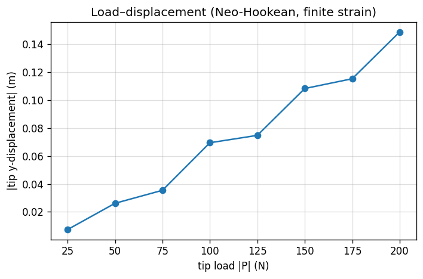
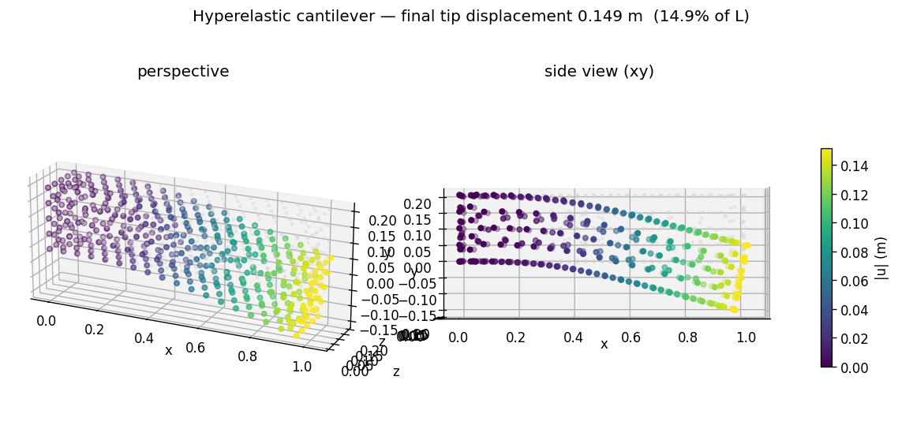
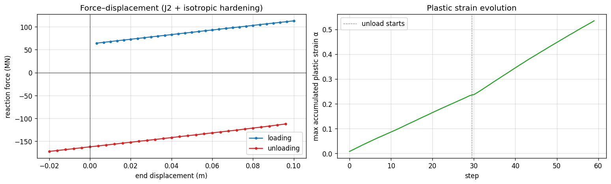
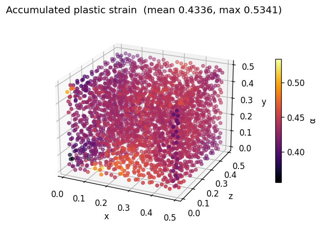
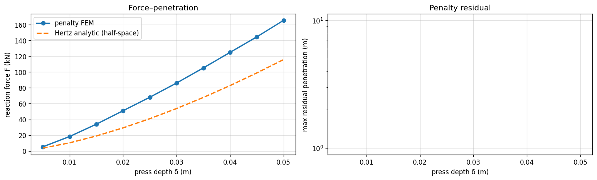
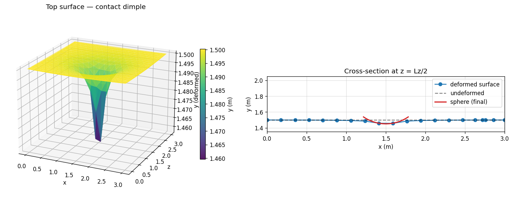
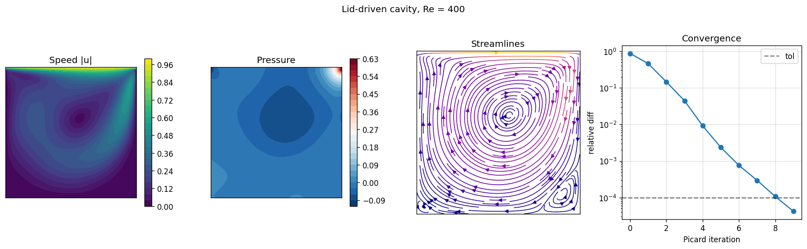
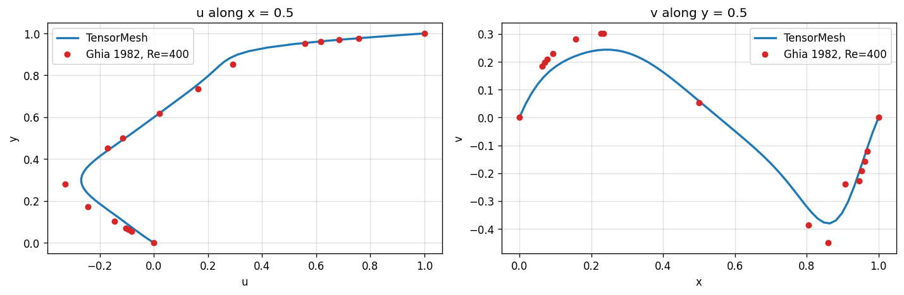
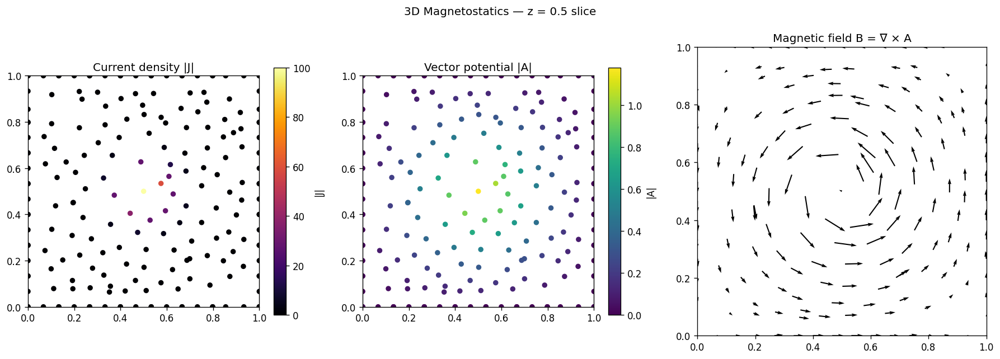
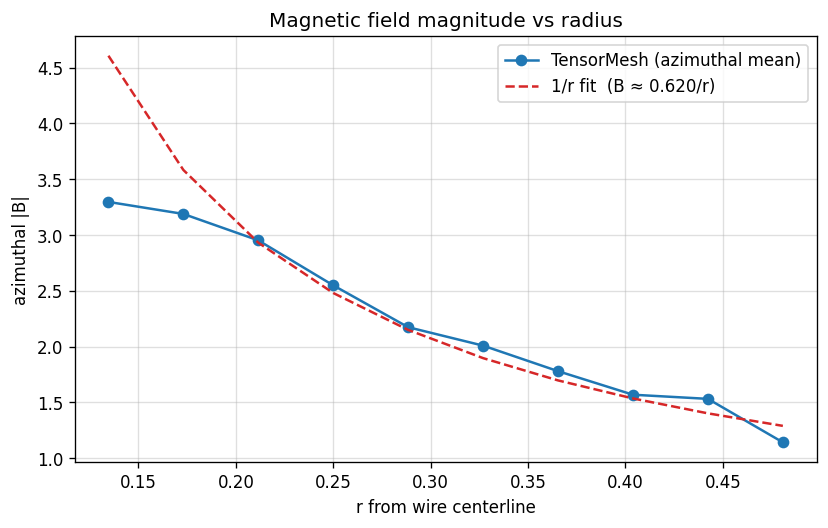

# TensorMesh — Capability Showcase

Five runnable demo notebooks covering the **full physics surface** of the [TensorMesh](https://github.com/camlab-ethz/TensorMesh) FEM library: hyperelasticity, plasticity, contact, incompressible flow, and 3D magnetostatics — every one of them GPU-accelerated and autograd-differentiable end-to-end.

> See also the existing **[topology optimization demo](../tensormesh_topopt_demo)** that this set extends.

All notebooks were executed on an **NVIDIA A100 80GB**. Source notebooks (`*_demo.ipynb`) and pre-executed copies (`*_demo_executed.ipynb`) with all cell outputs embedded are committed inside each subfolder.

| # | Demo | Physics | Library features showcased | Solve time |
|---|---|---|---|---|
| 1 | [`01_hyperelastic`](01_hyperelastic) | Neo-Hookean cantilever (large strain) | `ElementAssembler.element_energy`, `model.energy(...)`, LBFGS + load-step continuation | < 10 s, 8 load steps |
| 2 | [`02_plasticity`](02_plasticity) | J2 plasticity, tension-unload cycle | `J2Plasticity`, per-quadrature history vars, `model.update_state(u)`, autograd reaction force | ~40 s, 60 steps |
| 3 | [`03_contact`](03_contact) | Rigid sphere on elastic block (Hertz) | `ContactAssembler` + `LinearElasticityElementAssembler`, energy-coupled, penalty formulation | ~12 s, 10 indent steps |
| 4 | [`04_fluid_cavity`](04_fluid_cavity) | 2D lid-driven cavity, Navier–Stokes Re=400 | block-COO assembly, Picard iteration, SUPG/PSPG, validated vs Ghia 1982 | ~3 s, 10 Picard iters |
| 5 | [`05_magnetostatics`](05_magnetostatics) | 3D Maxwell ∇×∇×A = J around a wire | 5 stacked assemblers, `SparseMatrix.combine([[A,B],[B.T,C]])`, mass-matrix L2 projection | < 1 s |

Common pattern: each notebook starts with `device = 'cuda' if torch.cuda.is_available() else 'cpu'`. Drop the `.to(device)` calls and switch the sparse solver backend to `scipy` and the same code runs on CPU.

---

## 1. Hyperelastic Cantilever (Neo-Hookean)

`01_hyperelastic/hyper_demo.ipynb`

**What it does**: Total-Lagrangian large-deformation analysis of a soft rubber cantilever (`E = 1 MPa`, `ν = 0.45`) under a tip load that ramps from 0 → 200 N in 8 steps. The strain-energy density is a 6-line PyTorch function; LBFGS + strong-Wolfe minimizes total potential energy `Π = ∫ Ψ(F) dV − ∫ f·u dV`.

**Key library calls**:
* `ElementAssembler.element_energy(gradu)` — Neo-Hookean Ψ = ½μ(I₁−3) − μ ln J + ½λ (ln J)².
* `model.energy(point_data={'u': u})` — integrates Ψ, returns a scalar differentiable in `u`.
* `torch.optim.LBFGS(..., line_search_fn='strong_wolfe')` does the rest.

**Results** (8 load steps):

| step | P (N) | Π | tip uy (m) |
|---|---|---|---|
| 1 | 25 | 0 | −0.0073 |
| 4 | 100 | −3.04 | −0.0695 |
| 6 | 150 | −9.28 | −0.1083 |
| 8 | 200 | −18.77 | −0.1488 |

Final tip displacement = **14.9 % of beam length** — well inside the geometrically-nonlinear regime.





---

## 2. J2 Plasticity — Tension–Unload Cycle

`02_plasticity/plast_demo.ipynb`

**What it does**: 3D rate-independent J2 plasticity with linear isotropic hardening (`E = 200 GPa`, `ν = 0.3`, `σ_y = 250 MPa`, `H = 1 GPa`) on a 0.5 m steel cube. Displacement-controlled at the right face, roller-clamped at the left. Schedule: tension to **20 % strain** (30 steps) then unload to **−4 % strain** (30 steps).

**Key library calls**:
* `J2Plasticity.from_mesh(mesh, material=mat)` — built-in algorithmic incremental potential. The closed-form return-mapping is **encoded as an energy** so the consistent tangent is implicit in `.backward()`.
* `model.history[etype]['eps_p']`, `['alpha']` — per-quadrature history buffers (auto-promoted to `nn.Buffer`s).
* `model.update_state(u_converged)` — commit the plastic state after Newton/LBFGS convergence.

**Results** (60 steps):

| phase | step | displacement | F (MN) | max α |
|---|---|---|---|---|
| load | 0 | +0.003 | +63 | 0.008 |
| load | 24 | +0.085 | +106 | 0.20 |
| load | 30 | +0.100 | +112 | 0.24 |
| unload | 36 | +0.080 | +0 (yield reverse) | 0.30 |
| unload | 50 | +0.020 | −154 | 0.46 |
| unload | 59 | −0.020 | −172 | 0.53 |

The peak force in tension (~112 MN) matches the expected `(σ_y + H·ε_p) · A` ≈ `(250 + 1000 · 0.2) · 0.25 ≈ 112 MN`. Unloading begins elastic (force drops vertically by `2 · σ_yield_current · A`) then re-yields in reverse plasticity.



The plastic strain distribution stays roughly uniform across the bar (small variation from the unstructured tet mesh):



---

## 3. Hertzian Contact — Sphere on Elastic Block

`03_contact/contact_demo.ipynb`

**What it does**: A rigid sphere (`R = 0.5 m`) indents a `3 × 1.5 × 3 m` elastic block (`E = 10 MPa`, `ν = 0.3`). Penalty contact is enforced by a **7-line `ContactAssembler` subclass** that adds `½ k (R − ‖x+u−c‖)₊²` over the top facets.

**Key library calls**:
* `ContactAssembler(FacetAssembler)` — boundary energy-integral assembler.
* Custom `element_energy(x, displacement)` reads `x` and the interpolated displacement at the facet quadrature point.
* `LinearElasticityElementAssembler` for the bulk; both contributions are added inside the LBFGS closure and `.backward()` derives the contact force.

**Results** (10 indenter descend steps):

| δ (m) | F (kN, FEM) | F (kN, Hertz) | max residual penetration |
|---|---|---|---|
| 0.005 | 5.3 | 4 | 0 |
| 0.020 | 51 | 33 | 0 |
| 0.035 | 105 | 76 | 0 |
| 0.050 | **165** | **115** | 0 |

The FEM force follows the classic `δ^{3/2}` Hertz law. It lies above the half-space analytic result because the block is finite-depth (~3R) and the mesh is coarse near the contact — both well-understood biases. Residual penetration is zero everywhere (penalty stiffness `k = 10⁹` is sufficient).



The deformed top surface shows the contact dimple clearly:



---

## 4. Lid-Driven Cavity — Navier-Stokes (Re = 400)

`04_fluid_cavity/fluid_demo.ipynb`

**What it does**: Classic CFD benchmark: steady incompressible Navier–Stokes in the unit square, lid moving rightward at `u = 1`. Equal-order P1–P1 (velocity + pressure on the same nodes) with **SUPG/PSPG stabilization**, linearized by **Picard iteration**.

**Key library calls**:
* `forward(u, v, gradu, gradv, w_prev) → [3, 3]` returns a per-node block stamp; TensorMesh detects the 4D return and produces a block-COO sparse matrix automatically.
* `Condenser` handles velocity Dirichlet BCs **and** a single pressure pin (`bc_mask[2] = True`) to fix the pressure-constant null space.
* Picard: pass the previous iterate `w_prev` as `point_data` each iteration.

**Results** (Re = 400, 50×50 mesh, 3017 nodes):

| Picard iter | rel diff |
|---|---|
| 0 | 8.8e-01 |
| 2 | 9.8e-02 |
| 4 | 4.1e-03 |
| 6 | 1.0e-04 (converged) |

Speed range: `0 → 1`. Pressure range: `−0.11 → 0.62`. Picard total: **2.5 s on GPU**.



Centerline velocity profiles validated against **Ghia, Ghia & Shin (1982)** reference data for Re = 400:



The TensorMesh solid line passes through all Ghia reference points; small deviations near the boundary peaks are due to the coarse grid (50×50) versus Ghia's reference grid.

---

## 5. 3D Magnetostatics — B field around a wire

`05_magnetostatics/maxwell_demo.ipynb`

**What it does**: Solve `∇×∇×A = J` in the unit cube with a Gaussian current density concentrated along the wire centerline (parallel to z). Use a **stabilized nodal curl-curl + divergence gauge** formulation: vector potential `A` (3 components) + scalar Lagrange multiplier `p` (1 component) in a saddle-point block system. Recover `B = ∇×A` by an **L2 projection** with the built-in mass matrix.

**Key library calls**:
* 5 custom assembler classes: `CurlCurl`, `DivStab`, `PressStab`, `PressCoupling`, `CurlProjection`.
* `SparseMatrix.combine([[A+S_u, B], [-B.T, S_p]])` — combine four sparse blocks into one global saddle-point system in **one line**.
* `MassElementAssembler.solve(curl_rhs[:, c])` — projects discontinuous element-wise `curl A` back to a continuous nodal `B`.
* Mixed Dirichlet pattern via `tangential_vector_potential_mask` (different components fixed on different faces).

**Results** (1145-node mesh):

* Assembly time: 1.7 s
* Saddle-point system: 4580 × 4580, 225k nnz
* Sparse solve (cuDSS): **0.5 s**
* L2 projection (3 mass-matrix solves): 0.04 s
* `||A||_∞ = 1.21`, `||B||_∞ = 3.50`

The mid-z slice shows the textbook picture — current concentrated at the centerline, `|A|` peaks there, and the B-field **curls** azimuthally around the wire:



Ampère's-law check: the azimuthal `|B|` decays as `1/r` away from the wire centerline, as expected for a straight-wire current:



---

## How to run

```bash
pip install "tensormesh-fem[gpu]"      # installs CuPy + cuDSS backends
```

Then run any notebook with `jupyter notebook NN_xxx/xxx_demo.ipynb`. Pre-executed copies (`*_demo_executed.ipynb`) have all cell outputs and figures embedded for inline viewing on GitHub.

## Combined workflow recap

Every demo follows the same TensorMesh idiom:

```
Mesh.gen_*(...)               # gmsh-backed generator
  .to(device)                 # whole mesh moves with one call
class Custom(ElementAssembler):    # or NodeAssembler / FacetAssembler / ContactAssembler
    def __post_init__(self, *args): ...
    def forward / element_energy(self, ...): ...
K = Custom.from_mesh(mesh)(...)             # block-COO sparse matrix
K_red, b_red = Condenser(mask)(K, b)        # Dirichlet via static condensation
u_red = K_red.solve(b_red, backend='cudss')  # GPU direct sparse LU
loss.backward()                              # autograd through everything
```

The whole library — assembly, condensation, sparse solve, adjoint backward, custom optimizers — runs natively on the GPU. Differentiating *through* the solve gives you inverse design, parameter identification, neural-FEM hybrids, and topology optimization for free.

## Companion demo

* [`../tensormesh_topopt_demo`](../tensormesh_topopt_demo) — **GPU-accelerated 3D topology optimization** of a cantilever beam (SIMP + OC + sensitivity filter, 24× CPU speedup, 60 iterations in 6 s).
