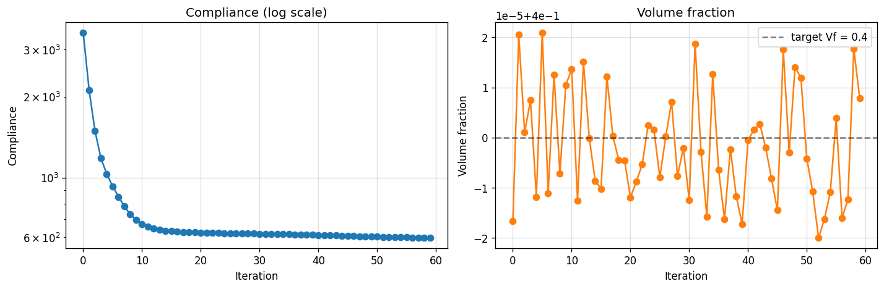
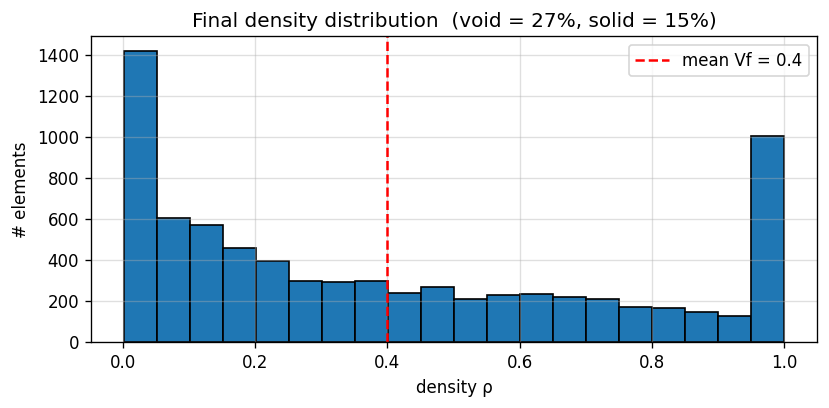
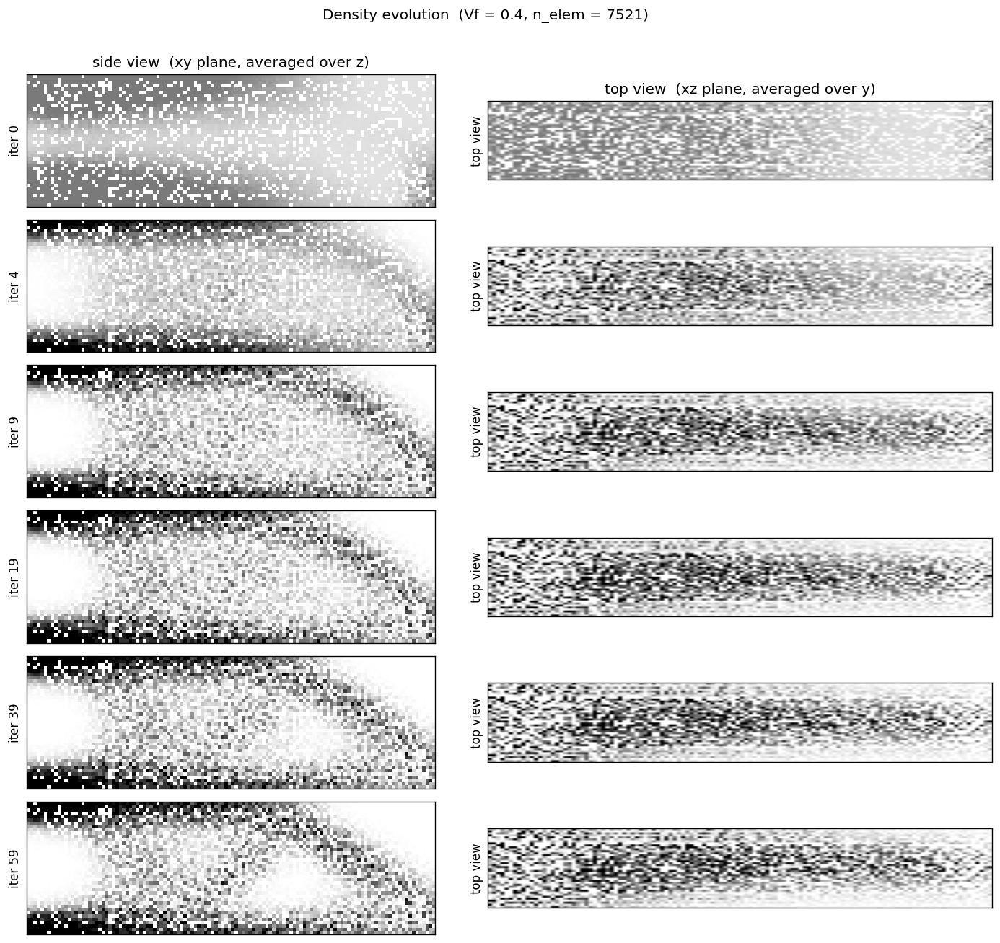
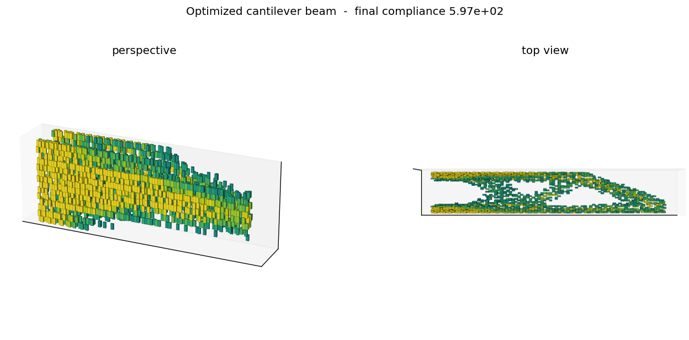

# TensorMesh GPU Demo — 3D Cantilever Beam Topology Optimization

End-to-end **GPU-accelerated topology optimization** with the [TensorMesh](https://github.com/camlab-ethz/TensorMesh) FEM library.

* `tensormesh_topopt_gpu_demo.ipynb` — the notebook source (run-this yourself).
* `tensormesh_topopt_gpu_demo_executed.ipynb` — pre-executed copy with all outputs embedded.

## What this demo shows

1. **GPU-native FEM** — 3D linear-elasticity stiffness assembled on the GPU in eager PyTorch.
2. **Custom weak form in pure Python** — a 6-line `SIMPElasticity(ElementAssembler)` subclass with `E(ρ) = E_min + ρ³(E₀ − E_min)`.
3. **End-to-end autograd through sparse solve** — `compliance.backward()` propagates through assembly → condensation → cuDSS LU factorization → recovery, returning `∂C/∂ρ` per element.
4. **Built-in OC optimizer + sensitivity filter** — `tensormesh.OCOptimizer` + Sigmund-style radial sensitivity filter; the filter mat-vec also runs on the GPU.
5. **CPU vs GPU benchmark** — same problem, same code, 24× faster on the GPU.

## Headline numbers (NVIDIA A100 80GB)

| Quantity | Value |
|---|---|
| Mesh | 1866 nodes, 7521 tets, 5598 DOFs |
| Forward+backward step (CPU, scipy LU) | 2305 ms |
| Forward+backward step (GPU, cuDSS LU) | 96 ms |
| **GPU speedup** | **24×** |
| Full OC loop (60 iterations) | 6.1 s (102 ms/iter) |
| Compliance reduction | 3462 → 597 (**5.8×**) |
| Volume fraction (held at `0.4`) | drift `< 2 × 10⁻⁵` |

## Results

Convergence: compliance drops 5.8× in ~20 iterations, volume held tight at `Vf = 0.4`.



Final density distribution — bimodal `void / solid` with a smooth transition from the filter:



Density evolution, 2D projections (side view = xy-plane averaged over z; top view = xz-plane averaged over y). The classic cantilever truss pattern emerges:



Final 3D voxelized truss — clamped face on the left, point load on the bottom-right:



## How to run

```bash
pip install "tensormesh-fem[gpu]"      # CUDA build (CuPy + cuDSS)
pip install nbformat nbconvert         # for headless execution
jupyter notebook tensormesh_topopt_gpu_demo.ipynb
```

Or one-shot headless:

```bash
jupyter nbconvert --to notebook --execute tensormesh_topopt_gpu_demo.ipynb \
    --output tensormesh_topopt_gpu_demo_executed.ipynb
```

CUDA available is auto-detected; falls back to CPU with `backend='scipy'` if no GPU.

## Workflow recap

```
Mesh.gen_cube(...)           # gmsh-backed mesh generation
    .to('cuda')              # move points + cells + masks to GPU
SIMPElasticity(ElementAssembler)
    .from_mesh(mesh, ...)    # tensorized vmap assembly setup
K = asm(element_data={'density': ρ})    # SparseMatrix on GPU
K_red, f_red = Condenser(mask)(K, f)    # Dirichlet static condensation
u_red = K_red.solve(f_red, backend='cudss', method='lu')   # cuDSS direct
compliance = (f * Condenser.recover(u_red)).sum()
compliance.backward()                                       # adjoint solve
OCOptimizer.step()                                          # OC bisection
```
