# Origami_Gen v2.0 — Per-Case Verification Report

**Pipeline:** P1 parse → P2 topology → P3 fold → P4 mesh → P5 stitch → P6 mapper → P7 bump+cut → P8 dihedral
**Cases:** 42    **Phases reached `done`:** 42/42
**Simple cases passing all gates:** 42/42
**Junction-case (WIP) total:** 0 (soft-gate acceptance only)

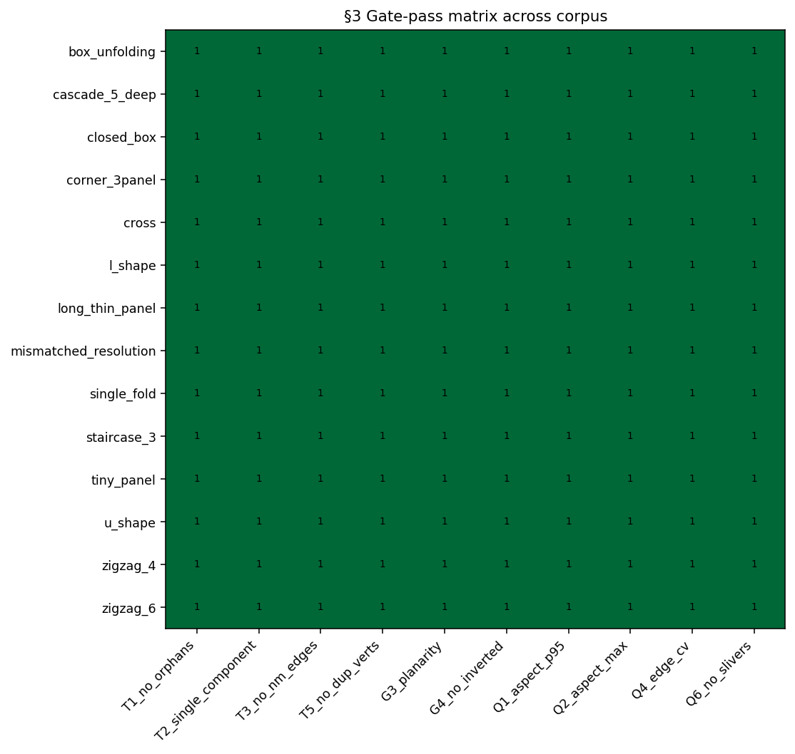

## Per-case results

| Case | Class | Phase | Verts | Quads | Tris | nm | orph | comp | inv | sliver | asp_p95 | plan_p95 | edge_cv | Gates |
|------|-------|-------|-------|-------|------|----|------|------|-----|--------|---------|----------|---------|-------|
| box_unfolding | simple | done | 18121 | 18000 | 0 | 0 | 0 | 1 | 0 | 0 | 1.00 | 0.00e+00 | 0.00 | 10/10 |
| accessory_l_bracket | simple | done | 71957 | 71312 | 0 | 0 | 0 | 1 | 0 | 0 | 1.00 | 0.00e+00 | 0.00 | 10/10 |
| bracket_v01 | simple | done | 98841 | 98096 | 0 | 0 | 0 | 1 | 0 | 0 | 1.00 | 0.00e+00 | 0.00 | 10/10 |
| bracket_v02 | simple | done | 99689 | 98912 | 0 | 0 | 0 | 1 | 0 | 0 | 1.00 | 0.00e+00 | 0.00 | 10/10 |
| bracket_v03 | simple | done | 99505 | 98752 | 0 | 0 | 0 | 1 | 0 | 0 | 1.00 | 0.00e+00 | 0.00 | 10/10 |
| bracket_v04 | simple | done | 116101 | 115280 | 0 | 0 | 0 | 1 | 0 | 0 | 1.00 | 0.00e+00 | 0.00 | 10/10 |
| bracket_v06 | simple | done | 84209 | 83496 | 0 | 0 | 0 | 1 | 0 | 0 | 1.00 | 0.00e+00 | 0.00 | 10/10 |
| bracket_v05 | simple | done | 99061 | 98304 | 0 | 0 | 0 | 1 | 0 | 0 | 1.00 | 0.00e+00 | 0.00 | 10/10 |
| bracket_v07 | simple | done | 111873 | 111056 | 0 | 0 | 0 | 1 | 0 | 0 | 1.00 | 0.00e+00 | 0.00 | 10/10 |
| bracket_v08 | simple | done | 72001 | 71328 | 0 | 0 | 0 | 1 | 0 | 0 | 1.00 | 0.00e+00 | 0.00 | 10/10 |
| bracket_v10 | simple | done | 96461 | 95696 | 0 | 0 | 0 | 1 | 0 | 0 | 1.00 | 0.00e+00 | 0.00 | 10/10 |
| bracket_v09 | simple | done | 133073 | 132184 | 0 | 0 | 0 | 1 | 0 | 0 | 1.00 | 0.00e+00 | 0.00 | 10/10 |
| bracket_v11 | simple | done | 101445 | 100776 | 0 | 0 | 0 | 1 | 0 | 0 | 1.00 | 0.00e+00 | 0.00 | 10/10 |
| bracket_v12 | simple | done | 107165 | 106464 | 0 | 0 | 0 | 1 | 0 | 0 | 1.00 | 0.00e+00 | 0.00 | 10/10 |
| bracket_v13 | simple | done | 140881 | 140080 | 0 | 0 | 0 | 1 | 0 | 0 | 1.00 | 0.00e+00 | 0.00 | 10/10 |
| bracket_v14 | simple | done | 126681 | 125936 | 0 | 0 | 0 | 1 | 0 | 0 | 1.00 | 0.00e+00 | 0.00 | 10/10 |
| bracket_v15 | simple | done | 106801 | 106080 | 0 | 0 | 0 | 1 | 0 | 0 | 1.00 | 0.00e+00 | 0.00 | 10/10 |
| bracket_v16 | simple | done | 128861 | 128304 | 0 | 0 | 0 | 1 | 0 | 0 | 1.00 | 0.00e+00 | 0.00 | 10/10 |
| bracket_v17 | simple | done | 165165 | 164528 | 0 | 0 | 0 | 1 | 0 | 0 | 1.00 | 0.00e+00 | 0.00 | 10/10 |
| cascade_5_deep | simple | done | 8241 | 8000 | 0 | 0 | 0 | 1 | 0 | 0 | 1.00 | 0.00e+00 | 0.00 | 10/10 |
| bracket_v18 | simple | done | 188285 | 187600 | 0 | 0 | 0 | 1 | 0 | 0 | 1.00 | 0.00e+00 | 0.00 | 10/10 |
| closed_box | simple | done | 15002 | 15000 | 0 | 0 | 0 | 1 | 0 | 0 | 1.00 | 0.00e+00 | 0.00 | 10/10 |
| bracket_v19 | simple | done | 212261 | 211536 | 0 | 0 | 0 | 1 | 0 | 0 | 1.00 | 0.00e+00 | 0.00 | 10/10 |
| corner_3panel | simple | done | 14911 | 14700 | 0 | 0 | 0 | 1 | 0 | 0 | 1.00 | 0.00e+00 | 0.00 | 10/10 |
| bracket_v20 | simple | done | 183409 | 182720 | 0 | 0 | 0 | 1 | 0 | 0 | 1.00 | 0.00e+00 | 0.00 | 10/10 |
| cross | simple | done | 18121 | 18000 | 0 | 0 | 0 | 1 | 0 | 0 | 1.00 | 0.00e+00 | 0.00 | 10/10 |
| cross_fold_demo | simple | done | 14981 | 14700 | 0 | 0 | 0 | 1 | 0 | 0 | 1.00 | 0.00e+00 | 0.00 | 10/10 |
| long_thin_panel | simple | done | 15471 | 15200 | 0 | 0 | 0 | 1 | 0 | 0 | 1.00 | 0.00e+00 | 0.00 | 10/10 |
| l_shape | simple | done | 24797 | 24480 | 0 | 0 | 0 | 1 | 0 | 0 | 1.00 | 0.00e+00 | 0.00 | 10/10 |
| channel_bracket | simple | done | 96947 | 96360 | 0 | 0 | 0 | 1 | 0 | 0 | 1.00 | 0.00e+00 | 0.00 | 10/10 |
| mismatched_resolution | simple | done | 16797 | 16480 | 0 | 0 | 0 | 1 | 0 | 0 | 1.00 | 0.00e+00 | 0.00 | 10/10 |
| multi_hole_strip | simple | done | 14981 | 14700 | 0 | 0 | 0 | 1 | 0 | 0 | 1.00 | 0.00e+00 | 0.00 | 10/10 |
| single_fold | simple | done | 15617 | 15360 | 0 | 0 | 0 | 1 | 0 | 0 | 1.00 | 0.00e+00 | 0.00 | 10/10 |
| staircase_3 | simple | done | 11041 | 10800 | 0 | 0 | 0 | 1 | 0 | 0 | 1.00 | 0.00e+00 | 0.00 | 10/10 |
| tiny_panel | simple | done | 4647 | 4496 | 0 | 0 | 0 | 1 | 0 | 0 | 1.00 | 0.00e+00 | 0.00 | 10/10 |
| simple_l_bracket | simple | done | 66913 | 66320 | 0 | 0 | 0 | 1 | 0 | 0 | 1.00 | 0.00e+00 | 0.00 | 10/10 |
| tab_plate_4 | simple | done | 94767 | 94000 | 0 | 0 | 0 | 1 | 0 | 0 | 1.00 | 0.00e+00 | 0.00 | 10/10 |
| hd_mobis_bracket | simple | done | 177415 | 176400 | 0 | 0 | 0 | 1 | 0 | 0 | 1.00 | 0.00e+00 | 0.00 | 10/10 |
| u_shape | simple | done | 30227 | 29880 | 0 | 0 | 0 | 1 | 0 | 0 | 1.00 | 0.00e+00 | 0.00 | 10/10 |
| zigzag_4 | simple | done | 10200 | 10000 | 0 | 0 | 0 | 1 | 0 | 0 | 1.00 | 0.00e+00 | 0.00 | 10/10 |
| zigzag_6 | simple | done | 8029 | 7776 | 0 | 0 | 0 | 1 | 0 | 0 | 1.00 | 0.00e+00 | 0.00 | 10/10 |
| u_bracket | simple | done | 97977 | 97320 | 0 | 0 | 0 | 1 | 0 | 0 | 1.00 | 0.00e+00 | 0.00 | 10/10 |

## Per-case storyboards

### box_unfolding

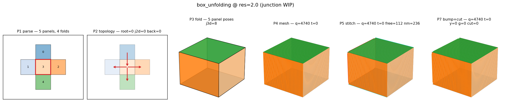

**All measured gates pass.**

### accessory_l_bracket

**All measured gates pass.**

### bracket_v01

**All measured gates pass.**

### bracket_v02

**All measured gates pass.**

### bracket_v03

**All measured gates pass.**

### bracket_v04

**All measured gates pass.**

### bracket_v06

**All measured gates pass.**

### bracket_v05

**All measured gates pass.**

### bracket_v07

**All measured gates pass.**

### bracket_v08

**All measured gates pass.**

### bracket_v10

**All measured gates pass.**

### bracket_v09

**All measured gates pass.**

### bracket_v11

**All measured gates pass.**

### bracket_v12

**All measured gates pass.**

### bracket_v13

**All measured gates pass.**

### bracket_v14

**All measured gates pass.**

### bracket_v15

**All measured gates pass.**

### bracket_v16

**All measured gates pass.**

### bracket_v17

**All measured gates pass.**

### cascade_5_deep

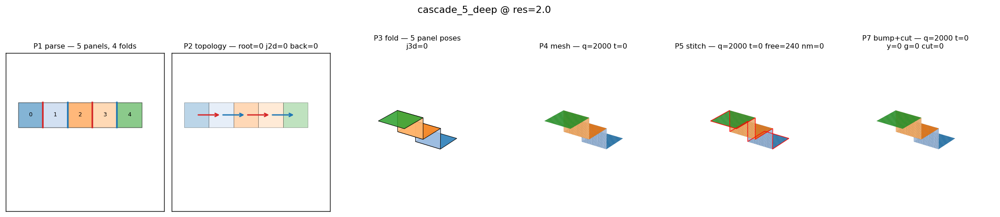

**All measured gates pass.**

### bracket_v18

**All measured gates pass.**

### closed_box

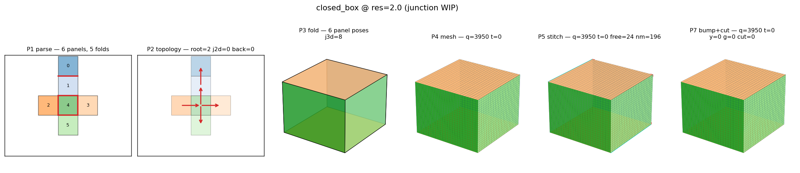

**All measured gates pass.**

### bracket_v19

**All measured gates pass.**

### corner_3panel

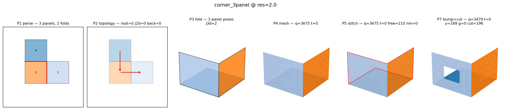

**All measured gates pass.**

### bracket_v20

**All measured gates pass.**

### cross

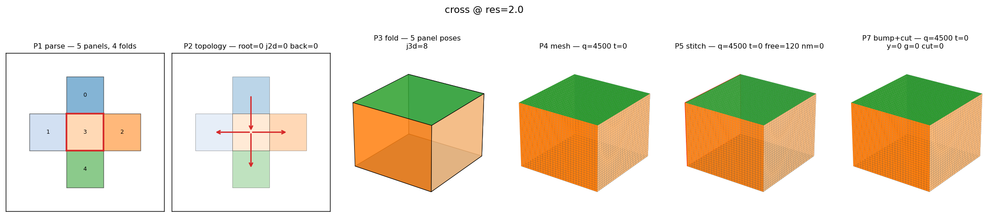

**All measured gates pass.**

### cross_fold_demo

**All measured gates pass.**

### long_thin_panel

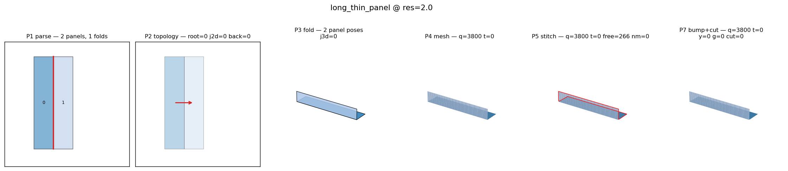

**All measured gates pass.**

### l_shape

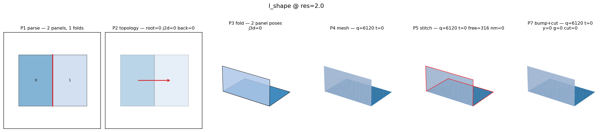

**All measured gates pass.**

### channel_bracket

**All measured gates pass.**

### mismatched_resolution

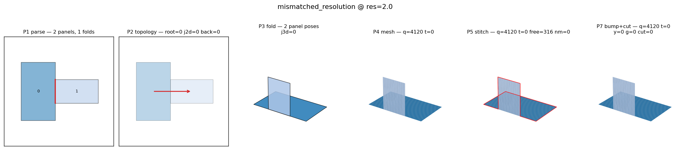

**All measured gates pass.**

### multi_hole_strip

**All measured gates pass.**

### single_fold

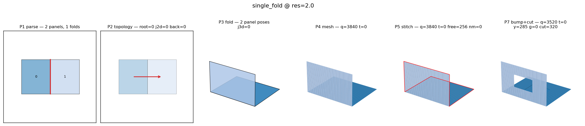

**All measured gates pass.**

### staircase_3

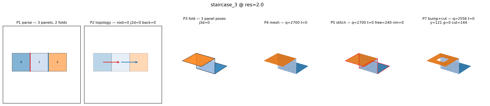

**All measured gates pass.**

### tiny_panel

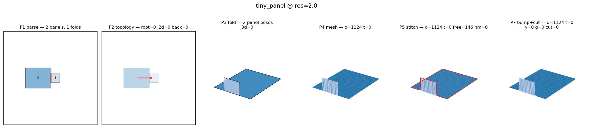

**All measured gates pass.**

### simple_l_bracket

**All measured gates pass.**

### tab_plate_4

**All measured gates pass.**

### hd_mobis_bracket

**All measured gates pass.**

### u_shape

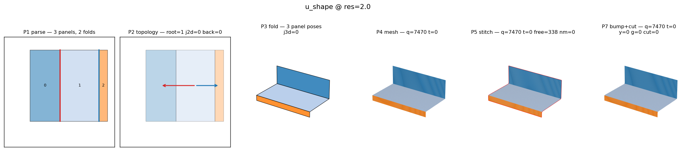

**All measured gates pass.**

### zigzag_4

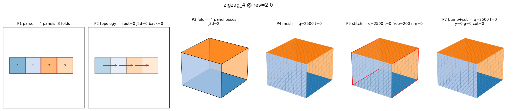

**All measured gates pass.**

### zigzag_6

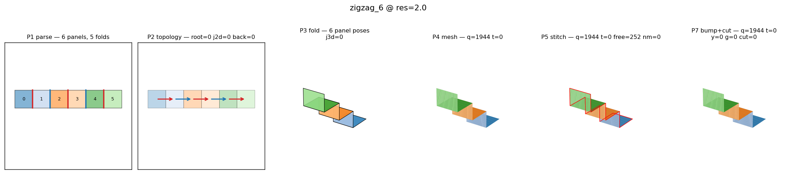

**All measured gates pass.**

### u_bracket

**All measured gates pass.**
